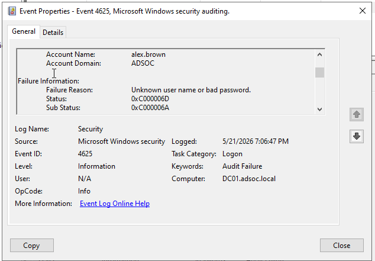
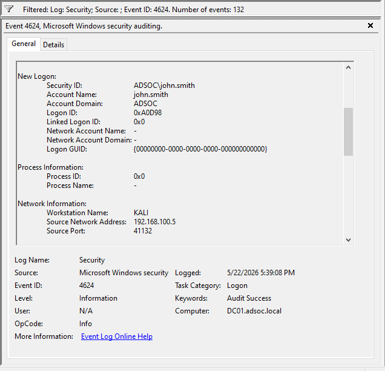
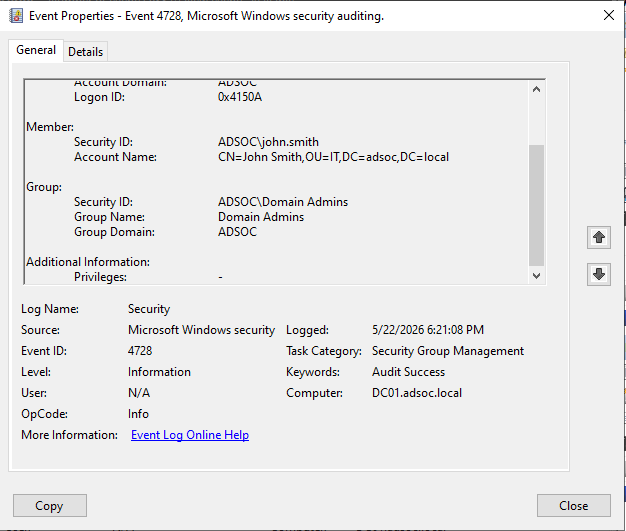

# ADSOC -- Active Directory Attack & Detection Lab

## Overview

ADSOC is an enterprise-style cybersecurity lab designed to simulate
**Active Directory attacks, Windows authentication telemetry, and SOC
investigation workflows** in a controlled environment.

The project focuses on generating realistic Windows Security events,
simulating identity-based attack scenarios, investigating authentication
activity, and translating observed telemetry into detection logic.

**Core focus areas:**

-   Active Directory administration
-   Authentication monitoring & investigation
-   Identity-based attack simulation
-   Privileged access monitoring
-   Active Directory reconnaissance analysis
-   Detection engineering fundamentals (KQL-style logic)

------------------------------------------------------------------------

## Lab Architecture

``` text
                 +----------------------+
                 |     Kali Linux       |
                 | (Adversary System)   |
                 +----------+-----------+
                            |
                            v
+--------------------------------------------------+
|         Windows Server 2022 (DC01)              |
| Active Directory + DNS + Authentication Services |
|        Windows Security Event Telemetry          |
+------------------------+-------------------------+
                         |
                         v
              +----------------------+
              |  Windows 11 (WS01)  |
              | Domain-Joined Client |
              +----------------------+
```

### Environment Components

  -----------------------------------------------------------------------
  System                  Role                    Purpose
  ----------------------- ----------------------- -----------------------
  `DC01`                  Domain Controller       Active Directory, DNS,
                                                  authentication, Windows
                                                  Security telemetry

  `WS01`                  Domain Workstation      Authentication activity
                                                  and user simulation

  `KALI`                  Adversary Host          Active Directory
                                                  reconnaissance and
                                                  authentication testing
  -----------------------------------------------------------------------

### Domain Configuration

  Setting             Value
  ------------------- ---------------
  Domain              `adsoc.local`
  Domain Controller   `DC01`
  Workstation         `WS01`

------------------------------------------------------------------------

## Attack & Detection Scenarios

  ------------------------------------------------------------------------
  Scenario                   Event ID(s) Security Focus   MITRE ATT&CK
  ---------------- --------------------- ---------------- ----------------
  Password                        `4625` Failed           `T1110.003`
  Spraying                               authentication   
  Detection                              monitoring       

  Account Lockout                 `4740` Authentication   `T1110`
  Investigation                          abuse            
                                         investigation    

  Active Directory                `4624` User & group     `T1087`, `T1069`
  Reconnaissance                         discovery        
                                         monitoring       

  Privileged Group                `4728` Privilege        `T1098`, `T1078`
  Membership                             escalation       
  Change                                 monitoring       

  Security Group                  `4728` Identity &       ---
  Membership                             access           
  Monitoring                             monitoring       
  ------------------------------------------------------------------------

------------------------------------------------------------------------

## Detection Engineering

The project includes **lab-oriented KQL-style detections** mapped to
generated Windows Security telemetry.

``` text
detections/kql/
├── password-spraying-detection.kql
├── account-lockout-detection.kql
├── privileged-group-membership-detection.kql
└── ad-reconnaissance-detection.kql
```

Detection logic focuses on:

-   Failed authentication monitoring (`4625`)
-   Account lockout visibility (`4740`)
-   Privileged group membership monitoring (`4728`)
-   Active Directory reconnaissance telemetry (`4624`)

------------------------------------------------------------------------

## Investigation Workflow

Each scenario follows a SOC-style workflow:

``` text
Attack Simulation
        ↓
Windows Security Telemetry
        ↓
Event Investigation
        ↓
Detection Logic (KQL-style)
        ↓
Documentation & Reporting
```

------------------------------------------------------------------------

## Investigation Evidence

### Password Spraying Detection (`4625`)



### Account Lockout Investigation (`4740`)


### Active Directory Reconnaissance (`4624`)



### Privileged Group Membership Change (`4728`)



------------------------------------------------------------------------

## Repository Structure

``` text
ADSOC-Active-Directory-Attack-Detection-Lab/
│
├── README.md
├── screenshots/
│
├── docs/
│   ├── architecture.md
│   ├── attack-scenarios.md
│   └── detections.md
│
├── detections/
│   ├── kql/
│   └── notes/
│
└── reports/
```

------------------------------------------------------------------------

## Documentation & Investigation Reports

  -----------------------------------------------------------------------
  Folder                              Purpose
  ----------------------------------- -----------------------------------
  `docs/`                             Architecture, scenarios, detection
                                      logic, and security context

  `reports/`                          SOC-style investigation reports
                                      with findings and evidence

  `detections/notes/`                 Analyst investigation notes and
                                      triage guidance

  `detections/kql/`                   Lab-oriented KQL detection logic
  -----------------------------------------------------------------------

------------------------------------------------------------------------

## Skills Demonstrated

-   Active Directory Administration
-   Windows Authentication & Identity Management
-   Windows Security Event Investigation
-   Authentication Abuse Detection
-   Privileged Access Monitoring
-   Active Directory Reconnaissance Investigation
-   Detection Engineering Fundamentals
-   SOC Investigation Workflows
-   MITRE ATT&CK Mapping

------------------------------------------------------------------------

## What This Project Demonstrates

This project demonstrates the ability to:

-   Build and manage an Active Directory environment
-   Generate realistic Windows Security telemetry
-   Investigate authentication and identity-related events
-   Simulate attacker behaviour in a controlled lab
-   Correlate suspicious activity with observable logs
-   Create KQL-style detection logic from observed telemetry
-   Document investigations using a SOC workflow
