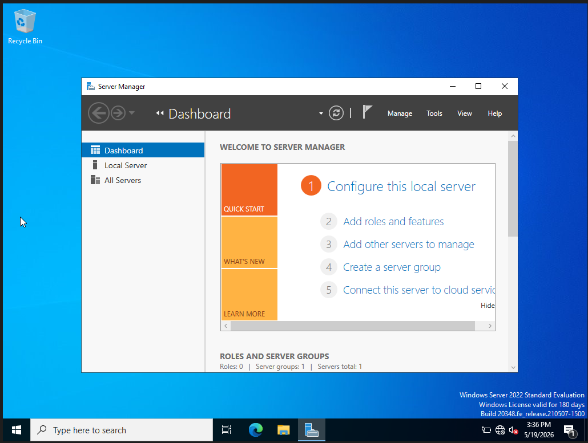
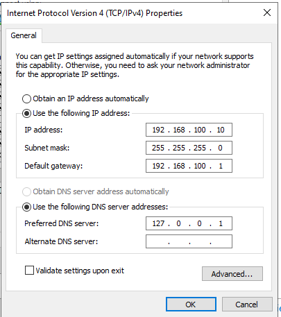
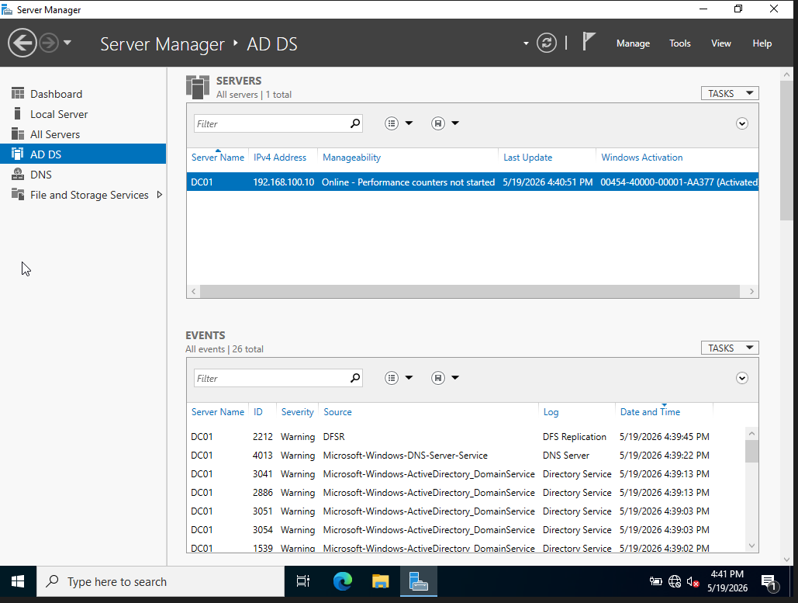
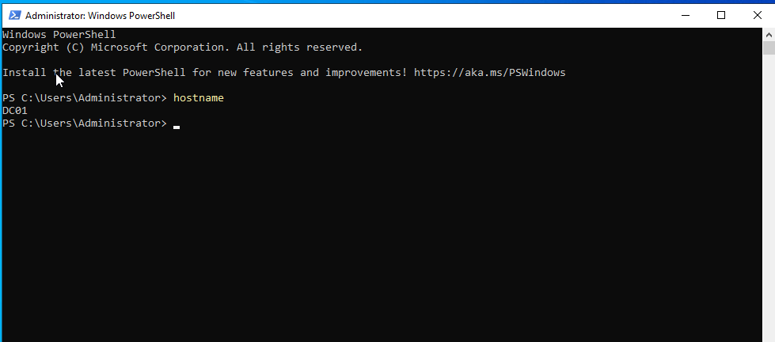
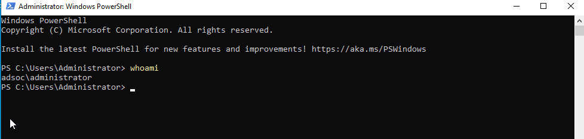

# ADSOC -- Active Directory Attack & Detection Lab

## Project Overview

Enterprise-style Active Directory Attack & Detection Lab simulating
identity attacks, Windows event logging, and SOC investigation
workflows.

---

## Lab Architecture

```text
Kali Linux (Attacker)
        |
        v
Windows Server 2022 (DC01)
        |
        v
Windows 11 Client
```

### Components

#### 1. Windows Server 2022 (DC01)

Purpose: - Future Domain Controller - Active Directory services - DNS
and authentication infrastructure

Configuration completed: - Hostname renamed to `DC01` - Static IP
configured - AD DS role installed

**Screenshot -- Windows Server VM**

Replace with your screenshot:



---

#### 2. Windows Server Static IP Configuration

Configured settings:

- IP Address: `192.168.100.10`
- Subnet Mask: `255.255.255.0`
- Default Gateway: `192.168.100.1`
- Preferred DNS: `127.0.0.1`

**Screenshot -- Static IP Configuration**

Replace with your screenshot:



---

#### 3. Active Directory Domain Services (AD DS)

Installed role: - Active Directory Domain Services (AD DS)

Purpose: - Prepare server for promotion into a Domain Controller

**Screenshot -- Server Manager (AD DS Installed)**

Replace with your screenshot:



---

#### 4. Hostname Verification

Verified hostname:

```powershell
hostname
```

Expected output:

```text
DC01
```

**Screenshot -- Hostname Verification**

Replace with your screenshot:



---

## Folder Structure

```text
ADSOC-Active-Directory-Attack-Detection-Lab/
│
├── README.md
├── screenshots/
│
├── docs/
│   ├── architecture.md
│   ├── attack-scenarios.md
│   └── detections.md
│
├── detections/
│   ├── kql/
│   └── notes/
│
└── reports/
```

---

#### 5. Active Directory Domain Setup

Successfully promoted `DC01` to a Domain Controller using Active Directory Domain Services (AD DS), establishing the internal domain environment for identity management and authentication testing.

### Configuration

- Domain: `adsoc.local`
- NetBIOS: `ADSOC`
- Server Role: Domain Controller + DNS

### Outcome

The environment now supports:

- Centralised authentication
- Domain-based identity management
- Group-based administration
- Enterprise-style Windows security event generation for SOC detection scenarios

### Verification

```powershell
whoami
```

Output:

```text
adsoc\administrator
```


