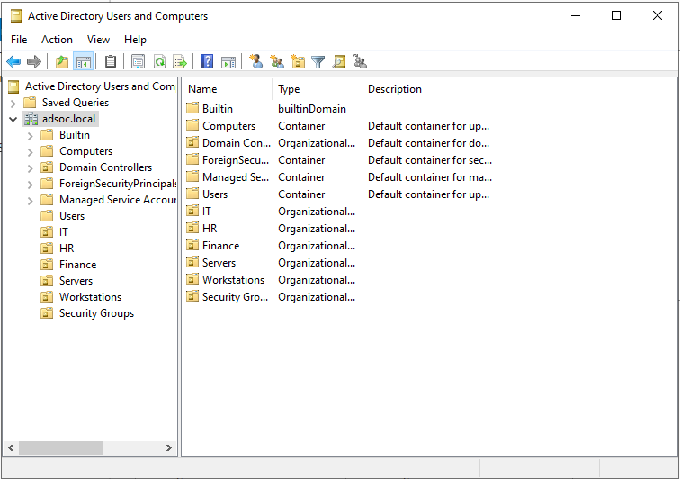

# ADSOC -- Active Directory Attack & Detection Lab

## Project Overview

ADSOC is an enterprise-style Active Directory Attack & Detection Lab
designed to simulate identity-based attacks, Windows authentication
workflows, and SOC investigation scenarios in a controlled environment.

The goal of this project is to build hands-on experience with:

- Active Directory administration
- Windows authentication and identity management
- Enterprise user/group modelling
- Security event generation and log analysis
- Identity-focused attack simulation
- SOC detection engineering and investigation workflows

---

## Lab Architecture

```text
Kali Linux (Attacker)
        |
        v
Windows Server 2022 (DC01)
        |
        v
Windows 11 Client
```

### Infrastructure Components

---

Component Purpose

---

Kali Linux Attack simulation and adversary
activity

Windows Server 2022 (DC01) Domain Controller, DNS,
authentication infrastructure

Windows 11 Client Domain-joined workstation for
authentication, telemetry, and
attack simulation

---

---

## Current Progress

- [x] Windows Server 2022 deployed
- [x] Static IP configured
- [x] Active Directory Domain Services (AD DS) installed
- [x] Domain Controller promotion completed
- [x] Enterprise OU, user, and group structure configured
- [ ] Windows 11 domain join
- [ ] Identity attack simulation
- [ ] Detection engineering and investigation workflows

---

# Phase 1 -- Active Directory Infrastructure

## Windows Server Deployment

Windows Server 2022 was deployed and configured as the foundation of the
Active Directory environment.

### Configuration Completed

- Hostname configured as `DC01`
- Static IP configuration applied
- Active Directory Domain Services (AD DS) installed

### Environment Snapshot


---

## Static IP Configuration

A static IP configuration was applied to ensure stable DNS resolution,
authentication, and Active Directory functionality.

Setting Value

---

IP Address `192.168.100.10`
Subnet Mask `255.255.255.0`
Default Gateway `192.168.100.1`
Preferred DNS `127.0.0.1`

### Configuration Snapshot


---

## Active Directory Domain Services (AD DS)

The Active Directory Domain Services role was installed to prepare the
server for Domain Controller promotion.

### Configuration Snapshot


---

## Domain Controller Configuration

`DC01` was promoted to a Domain Controller using Active Directory Domain
Services (AD DS), establishing the internal enterprise domain.

Setting Value

---

Domain Name `adsoc.local`
NetBIOS Name `ADSOC`
Server Role Domain Controller + DNS

### Verification

```powershell
whoami
```

Expected output:

```text
adsoc\administrator
```

### Verification Snapshot


---

## Active Directory Enterprise Configuration

A structured Active Directory environment was created to simulate a
realistic enterprise identity infrastructure.

### Organisational Units (OUs)

- IT
- HR
- Finance
- Servers
- Workstations
- Security Groups

### Security Groups

- IT_Admins
- HR_Users
- Finance_Users
- SOC_Analysts

### Example Domain Users

User Department Security Group

---

john.smith IT IT_Admins
emma.wilson HR HR_Users
alex.brown Finance Finance_Users
sarah.jones Security / IT SOC_Analysts

### Outcome

The environment now supports:

- Centralised identity management
- Group-based access modelling
- Authentication event generation
- Identity-based attack simulation
- Windows Security Event analysis for SOC workflows

### Environment Snapshot



---

## Repository Structure

```text
ADSOC-Active-Directory-Attack-Detection-Lab/
│
├── README.md
├── screenshots/
├── docs/
├── detections/
└── reports/
```

---

## Planned Attack Scenarios

- Password spraying
- Failed authentication attempts
- Account lockouts
- Privilege escalation via group membership changes
- Active Directory reconnaissance
- Windows authentication abuse

---

## Skills Demonstrated

- Active Directory Administration
- Windows Server Configuration
- Identity and Access Management (IAM)
- Authentication & Authorisation Concepts
- Enterprise User / Group Modelling
- Security Event Generation
- SOC Investigation Workflows
- Detection Engineering Fundamentals
