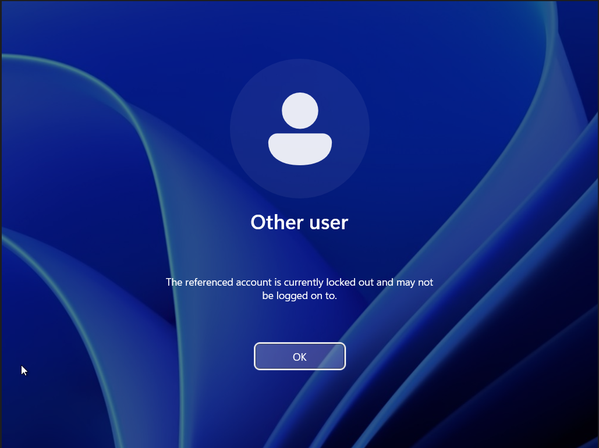
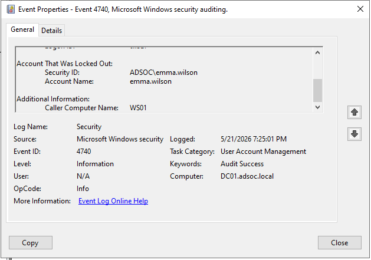

# Account Lockout Investigation Report

## Overview

This report documents the investigation of account lockout activity generated within the ADSOC Active Directory lab environment.

The objective was to validate detection visibility into authentication abuse activity and investigate account lockout telemetry generated after repeated failed authentication attempts.

---

## Investigation Metadata

| Field | Value |
|---|---|
| Investigation Date | `21/05/2026` |
| Investigation Time | `07:25 PM` |
| Domain Controller | `DC01` |
| Domain | `adsoc.local` |
| Detection Type | Account Lockout Activity |
| MITRE ATT&CK Context | `T1110 – Brute Force` |

---

## Scenario Summary

Repeated failed authentication attempts were generated against the Active Directory user account:

- `emma.wilson`

After repeated failed logon attempts exceeded the configured account lockout threshold, the account was automatically locked by Active Directory.

The investigation confirmed that the authentication activity originated from:

```text
WS01
```

---

## Detection Details

| Field | Value |
|---|---|
| Event ID | `4740` |
| Description | A user account was locked out |
| Log Source | Windows Security Event Log |

Observed account:

```text
emma.wilson
```

Observed caller system:

```text
WS01
```

---

## Investigation Timeline

| Timestamp | Event |
|---|---|
| `21/05/2026 07:25 PM` | Repeated failed authentication attempts observed |
| `21/05/2026 07:25 PM` | Account lockout triggered |
| `21/05/2026 07:25 PM` | Lockout telemetry investigated in Security logs |

---

## Investigation Findings

The investigation confirmed:

- Repeated failed authentication attempts occurred
- Account lockout policy enforcement functioned correctly
- Active Directory generated Event ID `4740`
- The lockout originated from `WS01`
- Authentication failures escalated into account lockout activity

---

## Evidence

### Account Lockout Message



### Event ID 4740 – Account Lockout



---

## Analyst Notes

During triage, analysts should investigate:

- Whether repeated failed logons preceded the lockout
- Whether multiple accounts experienced similar behaviour
- Whether the source system appears suspicious
- Whether lockout activity may indicate password spraying or brute-force attempts

---

## Conclusion

This investigation validated detection visibility into account lockout activity and demonstrated a SOC investigation workflow for identifying authentication abuse through Windows Security telemetry.