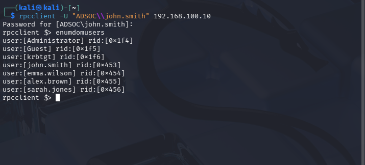
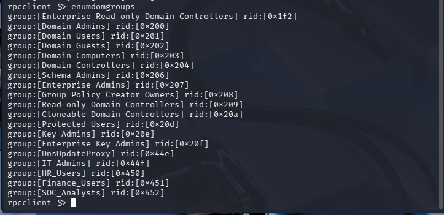

# Active Directory Reconnaissance Investigation Report

## Overview

This report documents the investigation of authenticated Active Directory reconnaissance activity performed against the ADSOC domain environment.

The objective was to validate visibility into authentication telemetry and investigate domain reconnaissance behaviour performed after successful authentication using valid domain credentials.

---

## Investigation Metadata

| Field | Value |
|---|---|
| Investigation Date | `22/05/2026` |
| Investigation Time | `05:39 PM` |
| Domain Controller | `DC01` |
| Domain | `adsoc.local` |
| Detection Type | Active Directory Reconnaissance |
| MITRE ATT&CK Context | `T1087 – Account Discovery`, `T1069 – Permission Group Discovery` |

---

## Scenario Summary

Authenticated reconnaissance activity was performed from a Kali Linux system against the Active Directory Domain Controller.

The activity used the following account:

```text
ADSOC\john.smith
```

The source system was identified as:

```text
KALI (192.168.100.5)
```

The following reconnaissance actions were performed:

- Domain user enumeration (`enumdomusers`)
- Domain group enumeration (`enumdomgroups`)

The investigation validated successful authentication telemetry and associated reconnaissance behaviour.

---

## Detection Details

| Field | Value |
|---|---|
| Event ID | `4624` |
| Description | An account was successfully logged on |
| Log Source | Windows Security Event Log |

Observed account:

```text
john.smith
```

Observed workstation:

```text
KALI
```

Observed source IP:

```text
192.168.100.5
```

---

## Investigation Timeline

| Timestamp | Event |
|---|---|
| `22/05/2026 05:34 PM` | Anonymous SMB enumeration attempt observed |
| `22/05/2026 05:39 PM` | Successful authentication from Kali observed |
| `22/05/2026 05:39 PM` | Domain user enumeration performed (`enumdomusers`) |
| `22/05/2026 05:39 PM` | Domain group enumeration performed (`enumdomgroups`) |
| `22/05/2026 05:39 PM` | Security log investigation completed |

---

## Investigation Findings

The investigation confirmed:

- Successful authentication occurred using valid domain credentials
- Authentication originated from a non-Windows system (`KALI`)
- The source IP address was identified as `192.168.100.5`
- User enumeration activity was performed
- Group enumeration activity was performed
- Event ID `4624` telemetry was generated and investigated

---

## Evidence

### Domain User Enumeration



### Domain Group Enumeration



### Authenticated Logon Telemetry


---

## Analyst Notes

During triage, analysts should investigate:

- Whether authentication originated from expected systems
- Whether non-Windows hosts authenticated to Active Directory
- Whether user/group enumeration followed authentication
- Whether the authenticated account should have performed reconnaissance activity
- Signs of privilege discovery or lateral movement preparation

---

## Conclusion

This investigation validated detection visibility into authenticated Active Directory reconnaissance activity and demonstrated a SOC investigation workflow for correlating authentication telemetry with domain enumeration behaviour.