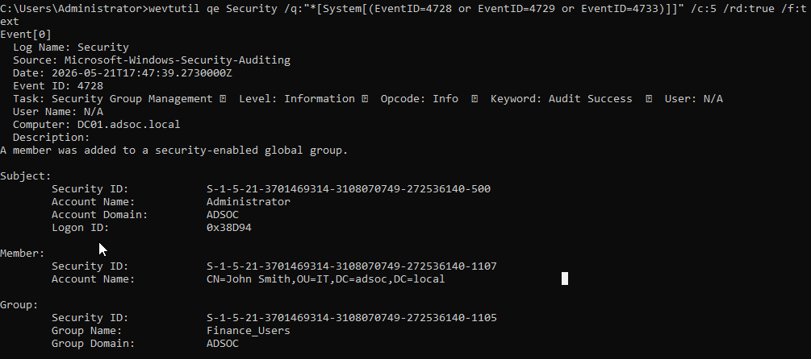

# Group Membership Change Investigation Report

## Overview

This report documents the investigation of an Active Directory security group membership modification within the ADSOC lab environment.

The objective was to validate visibility into permission and access-control changes using Windows Security logs.

---

## Scenario Summary

A domain administrator added `john.smith` to the `Finance_Users` Active Directory security group.

This activity was intentionally generated to simulate monitoring of access-control modifications that may be relevant to:

- Privileged access changes
- Insider activity
- Administrative misuse
- Unauthorised permission assignments

---

## Environment

| Component | Value |
|---|---|
| Domain Controller | `DC01` |
| Domain | `adsoc.local` |
| Modified User | `john.smith` |
| Security Group | `Finance_Users` |

---

## Detection Details

| Field | Value |
|---|---|
| Event ID | `4728` |
| Description | A member was added to a security-enabled global group |
| Source | Windows Security Event Log |

---

## Investigation Findings

The investigation confirmed:

- A security-enabled group membership modification occurred
- `john.smith` was added to `Finance_Users`
- The action was performed by an administrative account
- Event telemetry was successfully generated and investigated

---

## Evidence

---

## Conclusion

This scenario validated visibility into Active Directory permission changes and demonstrated a basic SOC workflow for investigating access-control modifications through Windows Security logs.