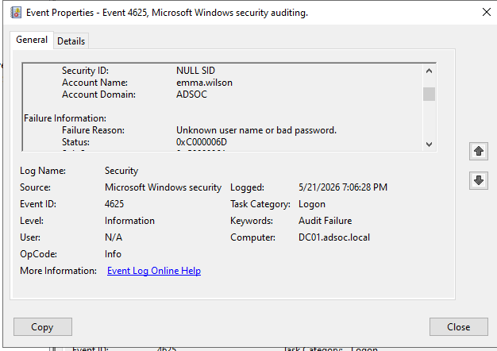

# Password Spraying Investigation Report

## Overview

This report documents the investigation of failed authentication activity generated within the ADSOC Active Directory lab environment to simulate password spraying behaviour.

The objective was to validate visibility into suspicious authentication activity through Windows Security logs and investigate failed authentication telemetry.

---

## Investigation Metadata

| Field | Value |
|---|---|
| Investigation Date | `21/05/2026` |
| Investigation Time | `07:06 PM` |
| Domain Controller | `DC1` |
| Domain | `adsoc.local` |
| Detection Type | Password Spraying Activity |
| MITRE ATT&CK | `T1110.003 – Password Spraying` |

---

## Scenario Summary

Multiple failed authentication attempts were generated against multiple Active Directory user accounts using the same incorrect password.

The following users were targeted:

- `emma.wilson`
- `alex.brown`

This activity simulates password spraying behaviour where attackers attempt a single password across multiple accounts to reduce account lockout risk and evade detection.

---

## Detection Details

| Field | Value |
|---|---|
| Event ID | `4625` |
| Description | An account failed to log on |
| Log Source | Windows Security Event Log |

Observed failure reason:

```text
Unknown user name or bad password
```

---

## Investigation Timeline

| Timestamp | Event |
|---|---|
| `21/05/2026 07:06:28 PM` | Failed authentication observed for `emma.wilson` |
| `21/05/2026 07:06:47 PM` | Failed authentication observed for `alex.brown` |

---

## Investigation Findings

The investigation confirmed:

- Multiple failed authentication attempts occurred
- Authentication failures targeted multiple domain accounts
- Authentication telemetry was successfully generated and investigated
- Windows Security logs recorded Event ID `4625`
- Authentication behaviour aligned with password spraying characteristics

---

## Evidence

### Failed Authentication – emma.wilson



### Failed Authentication – alex.brown


---

## Analyst Notes

Indicators that may suggest password spraying activity include:

- Failed logons across multiple accounts
- Similar timing patterns between authentication attempts
- Repeated password failures without account lockout
- Authentication failures originating from the same host or process

---

## Conclusion

This scenario validated detection visibility into failed Active Directory authentication attempts and demonstrated a SOC investigation workflow for identifying suspicious authentication behaviour consistent with password spraying activity.